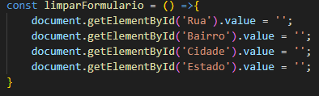
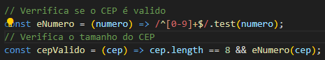
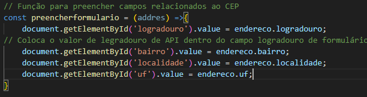
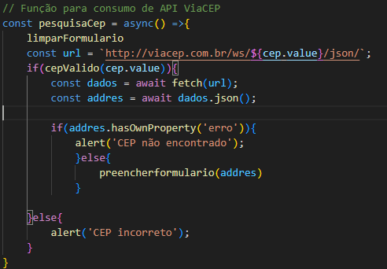
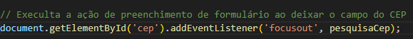

# Formulário de Endereço

## Descrição do projeto

O projeto visa criar um formulário de cadastro de endereço intuitivo e eficiente, que permita aos usuários inserir, atualizar e gerenciar suas informações de localização de forma simples e rápida. O formulário será utilizado em uma plataforma online, facilitando a coleta de dados necessários para entregas, correspondências e comunicações.

## Limpar consulta do form já realizada

### const limparFormulario = () =>
* usando a sintaxe de arrow function. Essa função não recebe parâmetros.

###  document.getElementById('Rua').value = '';document.getElementById('Bairro').value = '';document.getElementById('Cidade').value = '';document.getElementById('Estado').value = '';
* o elemento HTML com o ID Rua e define seu valor (value) como uma string vazia (''). Isso limpa o campo de entrada correspondente.

## Verrifica se o CEP é valido e Verifica o tamanho do CEP

### const eNumero = (numero) => /^[0-9]+$/.test(numero);
* const: 
Declara uma constante, ou seja, uma variável cujo valor não pode ser alterado após sua inicialização.
* eNumero: 
É o nome escolhido para essa constante. Você pode escolher qualquer nome válido para uma variável.
* (numero) =>:
Essa parte define uma função arrow function. Uma arrow function é uma forma mais concisa de escrever funções em JavaScript.
* /^\[0-9\]+$/: 
É uma expressão regular (regex). Expressões regulares são padrões que podem ser usados para encontrar correspondências em strings.
* .test(numero): É um método do objeto RegExp (expressão regular) que verifica se a string passada como argumento corresponde à expressão regular. Retorna true se houver correspondência e false caso contrário.

### const cepValido = (cep) => cep.length == 8 && eNumero(cep);
* const: 
Define uma constante, ou seja, uma variável cujo valor não pode ser alterado após sua inicialização.
* cepValido:
É o nome dado a essa constante, escolhido para representar a função que verifica a validade de um CEP.
* cep:
Define um parâmetro da função, que representa o valor do CEP que queremos validar.
* =>:
Indica que estamos definindo uma função arrow function, uma forma mais concisa de escrever funções em JavaScript.
* cep.length == 8: 
Verifica se o comprimento da string cep é igual a 8. Um CEP válido no Brasil possui exatamente 8 dígitos.
* &&: 
É o operador lógico "e". Significa que ambas as condições à esquerda e à direita do operador devem ser verdadeiras para que o resultado final seja verdadeiro.
* eNumero(cep): 
Chama a função eNumero (que você já definiu anteriormente) passando o valor do CEP como argumento. Essa função, como você explicou, verifica se todos os caracteres do CEP são números

## Função para preencher campos relacionados ao CEP e Coloca o valor de legradouro de API dentro do campo logradouro de formulário

### const preencherformulario = (addres) =>

* const preencherFormulario =:
* const: Declara uma constante, ou seja, uma variável cujo valor não pode ser alterado após sua inicialização.
* preencherFormulario: É o nome dado à função. Esse nome é utilizado para chamar a função posteriormente.
* =: O sinal de igual é usado para atribuir um valor à constante.
* (): Os parênteses indicam que estamos definindo uma função.
* (endereco): Dentro dos parênteses, temos o parâmetro endereco. Esse parâmetro é um objeto que contém as informações do endereço a ser preenchido no formulário.>

### document.getElementById('logradouro').value = endereco.logradouro;

* document.getElementById('logradouro'):
* document: Representa o documento HTML completo.
* getElementById('logradouro'): É um método do objeto document que busca um elemento HTML pelo seu ID. No caso, estamos procurando um elemento com o ID logradouro. Esse elemento provavelmente é um campo de input (como um campo de texto) onde será exibido o logradouro.
* .value = endereco.logradouro;:
* .value: Essa propriedade define ou retorna o valor de um elemento de formulário.
* endereco.logradouro: Acessamos a propriedade logradouro do objeto endereco. Essa propriedade contém o valor do logradouro (rua) que será atribuído ao campo de input.

### // Função para consumo de API ViaCEP

### const pesquisaCep = async() => 

* const: Define uma constante, ou seja, uma variável cujo valor não pode ser alterado após sua inicialização.
* pesquisaCep: É o nome da função que estamos definindo. Ela será responsável por realizar a pesquisa do CEP.
* async: Indica que essa função é assíncrona, ou seja, ela pode realizar operações que levam tempo, como a requisição à API, sem bloquear a execução do restante do código.

* limparFormulario(); Chama uma função (não mostrada no código) chamada limparFormulario. Essa função provavelmente limpa todos os campos de um formulário HTML, preparando-o para uma nova pesquisa.

### const url =https://viacep.com.br/ws/${cep.value}/json/;

* const url: Cria uma constante para armazenar a URL da API que será utilizada para buscar as informações do CEP.
* https://viacep.com.br/ws/${cep.value}/json/: É a URL da API do ViaCEP, onde o {cep.value} será substituído pelo valor do CEP digitado pelo usuário. Essa URL é formatada para realizar uma consulta específica para o CEP informado.

### if(cepValido(cep.value))

* if: Inicia uma estrutura condicional. Se a condição dentro dos parênteses for verdadeira, o código dentro das chaves será executado.
* cepValido(cep.value): Chama uma função (não mostrada no código) chamada cepValido para verificar se o CEP digitado pelo usuário é válido. Essa função provavelmente verifica se o CEP tem o formato correto (8 dígitos numéricos).

### const dados = await fetch(url);

* const dados: Cria uma constante para armazenar os dados retornados pela API.
* await fetch(url): Realiza uma requisição à URL construída anteriormente usando a função fetch. O await faz com que a execução da função pause até que a requisição seja concluída, garantindo que os dados estejam disponíveis antes de continuar.

### const addres = await dados.json();

* const addres: Cria uma constante para armazenar os dados da resposta da API convertidos para um formato JSON (JavaScript Object Notation).
* await dados.json(): Converte os dados recebidos da API, que estão em formato textual, para um objeto JavaScript, facilitando o acesso às informações do endereço.
* if(addres.hasOwnProperty('erro')): Verifica se o objeto addres possui uma propriedade chamada 'erro'. Se essa propriedade existir, significa que o CEP não foi encontrado.
* alert('CEP não encontrado'): Exibe uma mensagem de alerta para o usuário informando que o CEP não foi encontrado.

### else
* Caso o CEP tenha sido encontrado, o código dentro deste bloco será executado.
### preencherFormulario(addres)
* Chama a função preencherFormulario (não mostrada no código) para preencher os campos do formulário com as informações do endereço contidas no objeto addres.

## Execulta a ação de preenchimento de formulário ao deixar o campo do CEP

### document.getElementById('cep'):

* document: Representa o documento HTML completo.
* getElementById('cep'): Busca um elemento HTML pelo seu ID. Neste caso, está procurando o elemento com o ID "cep". Provavelmente, esse elemento é um campo de entrada (input) onde o usuário digita o CEP.

### .addEventListener('focusout', pesquisaCep):

* .addEventListener: É um método que adiciona um ouvinte de eventos a um elemento HTML.
* 'focusout': Especifica o tipo de evento que está sendo escutado. "focusout" significa que o evento será disparado quando o foco sai do elemento.
* pesquisaCep: É o nome da função que será executada quando o evento "focusout" ocorrer.

# Resultado

# Autora:

## Liara